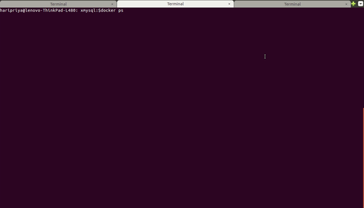

[](https://travis-ci.org/o1lab/xmysql)
[](https://raw.githubusercontent.com/o1lab/xmysql/master/LICENSE)

# Xmysql : One command to generate REST APIs for any MySQL database

# Why this ?
<p align="center">
  
</p>

Generating REST APIs for a MySql database which does not follow conventions of 
frameworks such as rails, django, laravel etc is a small adventure that one like to avoid ..

Hence this.

# Setup and Usage

xmysql requires node >= 7.6.0

```
npm install -g xmysql
```
```
xmysql -h localhost -u mysqlUsername -p mysqlPassword -d databaseName
```
```
http://localhost:3000
```
<br>

That is it! Minimalistic! 


# Example : Generate REST APIs for your database running under docker instance

<p align="center">
  
</p>


# Features
* Generates API for **ANY** MySql database :fire::fire:
* Serves APIs irrespective of naming conventions of primary keys, foreign keys, tables etc :fire::fire:
* Support for composite primary keys :fire::fire:
* REST API Usual suspects : CRUD, List, FindOne, Count, Exists, Distinct
* Bulk insert, Bulk delete, Bulk read :fire:   
* Relations
* Pagination 
* Sorting
* Column filtering - Fields :fire:  
* Row filtering - Where :fire:
* Aggregate functions
* Group By, Having (as query params) :fire::fire:  
* Group By, Having (as a separate API) :fire::fire:  
* Multiple group by in one API :fire::fire::fire::fire:
* Chart API for numeric column :fire::fire::fire::fire::fire::fire:
* Auto Chart API - (a gift for lazy while prototyping) :fire::fire::fire::fire::fire::fire:
* [XJOIN - (Supports any number of JOINS)](#xjoin) :fire::fire::fire::fire::fire::fire::fire::fire::fire:
* Supports views  
* Prototyping (features available when using local MySql server only)
    * Run dynamic queries :fire::fire::fire:
    * Upload single file
    * Upload multiple files
    * Download file
* Health and version apis
* Use more than one CPU Cores
* [Docker support](#docker) and [Nginx reverse proxy config](#nginx-reverse-proxy-config-with-docker) :fire::fire::fire: - Thanks to [@markuman](https://github.com/markuman)  
* AWS Lambda Example - Thanks to [@bertyhell](https://github.com/bertyhell) :fire::fire::fire:


Use HTTP clients like [Postman](https://www.getpostman.com/) or [similar tools](https://chrome.google.com/webstore/search/http%20client?_category=apps) to invoke REST API calls

____


## API Overview

| HTTP Type | API URL                          | Comments                                               |
|-----------|----------------------------------|--------------------------------------------------------- 
| GET       | /                                | Gets all REST APIs                                     |
| GET       | /api/tableName                   | Lists rows of table                                    |
| POST      | /api/tableName                   | Create a new row                                       |
| PUT       | /api/tableName                   | Replaces existing row with new row                     |
| POST :fire:| /api/tableName/bulk             | Create multiple rows - send object array in request body|
| GET  :fire:| /api/tableName/bulk             | Lists multiple rows - /api/tableName/bulk?_ids=1,2,3   |
| DELETE :fire:| /api/tableName/bulk           | Deletes multiple rows - /api/tableName/bulk?_ids=1,2,3 |
| GET       | /api/tableName/:id               | Retrieves a row by primary key                         |
| PATCH     | /api/tableName/:id               | Updates row element by primary key                     |
| DELETE    | /api/tableName/:id               | Delete a row by primary key                            |
| GET       | /api/tableName/findOne           | Works as list but gets single record matching criteria |
| GET       | /api/tableName/count             | Count number of rows in a table                        |
| GET       | /api/tableName/distinct          | Distinct row(s) in table - /api/tableName/distinct?_fields=col1|
| GET       | /api/tableName/:id/exists        | True or false whether a row exists or not              |
| GET       | [/api/parentTable/:id/childTable](#relational-tables)             | Get list of child table rows with parent table foreign key   | 
| GET :fire:| [/api/tableName/aggregate](#aggregate-functions)                  | Aggregate results of numeric column(s)                 |
| GET :fire:| [/api/tableName/groupby](#group-by-having-as-api)                 | Group by results of column(s)                          |
| GET :fire:| [/api/tableName/ugroupby](#union-of-multiple-group-by-statements) | Multiple group by results using one call               |
| GET :fire:| [/api/tableName/chart](#chart)                                    | Numeric column distribution based on (min,max,step) or(step array) or (automagic)|
| GET :fire:| [/api/tableName/autochart](#autochart)                            | Same as Chart but identifies which are numeric column automatically - gift for lazy while prototyping|
| GET :fire:| [/api/xjoin](#xjoin)                                              | handles join                                        |
| GET :fire:| [/dynamic](#run-dynamic-queries)                                  | execute dynamic mysql statements with params           |
| GET :fire:| [/upload](#upload-single-file)                                    | upload single file                                     |
| GET :fire:| [/uploads](#upload-multiple-files)                                | upload multiple files                                  |
| GET :fire:| [/download](#download-file)                                       | download a file                                        |
| GET       | /api/tableName/describe                                           | describe each table for its columns      |
| GET       | /api/tables                                                       | get all tables in database                           |
| GET       | [/_health](#health)                                               | gets health of process and mysql -- details query params for more details |
| GET       | [/_version](#version)                                             | gets version of Xmysql, mysql, node|


# Debugging xmysql in docker.

Given you've deployed your xmysql docker container like

`` docker run -d \
--network local_dev \
--name xmysql \
-p 3000:80 \
-e DATABASE_HOST=mysql_host \
-e DATABASE_USER=root \
-e DATABASE_PASSWORD=password \
-e DATABASE_NAME=sys \
markuman/xmysql:0.4.2
`` 

but the response is just

``["http://127.0.0.1:3000/api/tables","http://127.0.0.1:3000/api/xjoin"]``

then obviously the connection to your mysql database failed.

    attache to the xmysql image
        ``docker exec -ti xmysql``
    install mysql cli client
        ``apk --update --no-cache add mysql-client``
    try to access your mysql database
        ``mysql-client -h mysql_host``
    profit from the mysql-client error output and improve the environment variables for mysql

## Nginx Reverse Proxy Config with Docker

This is a config example when you use nginx as reverse proxy

``
events {
   worker_connections 1024;
   
}

http {
    server {
        server_name 127.0.0.1;
        listen 80 ;
        location / {
            rewrite ^/(.*) /$1 break;
            proxy_redirect off;
            proxy_set_header Host $host;
            proxy_set_header X-Forwarded-For $proxy_add_x_forwarded_for;
            proxy_pass http://127.0.0.1:3000;
        }
    }
}``

e.g.

    create a docker network ``docker network create local_dev``
    start a mysql server ``docker run -d --name mysql -p 3306:3306 --network local_dev -e MYSQL_ROOT_PASSWORD=password mysql``
    start xmysql ``docker run -d --network local_dev --name xmyxql -e DATABASE_NAME=sys -e DATABASE_HOST=mysql -p 3000:80 markuman/xmysql:0.4.2``
    start nginx on host system with the config above sudo nginx -g 'daemon off;' -c /tmp/nginx.conf``
    profit ``curl http://127.0.0.1/api/host_summary_by_file_io_type/describe``

When you start your nginx proxy in a docker container too, use as ``proxy_pass`` the ``--name`` value of xmysql. E.g. ``proxy_pass http://xmysql`` (remember, xmysql runs in it's docker container already on port 80).
Tests : setup on local machine


# Tests : setup on local machine

``docker-compose run test``


